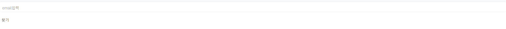
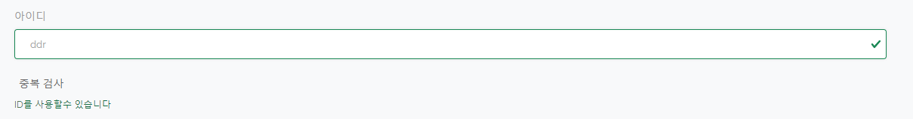
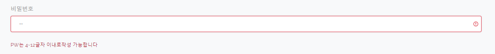

# Link Mall(전자기기 쇼핑몰)

## 목차

- [프로젝트 개요](#프로젝트-개요)
- [팀 역할 분배](#팀-역할-분배)
- [사용 기술 및 도구](#사용-기술-및-도구)
- [기능구현](#기능구현)
  - 기능?
- [배포](#배포)
- [ISSUE](#ISSUE)

## 프로젝트 개요

   
    
   

> **프로젝트:** 쇼핑몰 ( 전자기기 )
>
> **기획 및 제작:** 이승엽, 김희진, 전승민
>
> **분류:** 팀 프로젝트 
>
> **제작 기간:** 2023.03.06 ~ 04.14
>
> **배포일:** 미정
>
> **사용 언어:** JAVA, JAVASCRIPT, JSP, OracleDB,
> 
> **프레임 워크:** Spring Framework

## 팀 역할 분배
> **팀장:** 이승엽
> 
> 

> **팀원:** 김희진
>
> 
> **팀원:** 전승민
> 회원 : 회원가입(이메일 인증 API), 회원 수정(비밀번호 변경),ID 찾기,로그 아웃, 로그인(카카오 API)
> 상품 선택 : 상품 추가 버튼 클릭 시 첫번째 옵션선택 옵션선택 완료시 다음 옵션 선택 최종 옵션 선택시 수량 나옴
> 상품 옵션 추가 : 옵션 추가시 최대 2개의 하위옵션을 가짐 마지막 옵션에서 수량과 가격 추가

## 사용 기술 및 도구

|**Category**|**Detail**|
|:--:|:--:|
|**FrontEnd**| `HTML5`, `JavaScript`, `JQuery`, `CSS`, `BootStrap`|
|**BackEnd**| `Java(JDK 1.8)`, `Servlet`, `Spring`, `Mybatis` |
|**OS**| `Windows 10`, `Windows 11` |
|**Libray & API**| `KAKAO LOGIN API, EMAIL API` |
|**IDE**| `STS3`, `VisualStudio Code`, `DBeaver` |
|**Server**| `TOMCART 9.0.71` |
|**Document**| `Google Drive`, `ERDCloud`, `Notion` |
|**CI**| `Github` |
|**DB**| `Docker`, `Oracle` |

## 기능구현
### 1 MEMBER
#### 1-1 로그인

- 로그인 성공 시 로그인 성공이라는 문구가 출력된후 메인 홈페이지로 돌아감

-성공

-실패

#### 1-2 ID 찾기

-D찾기를 클릭 시 email을 입력 → 이메일이 일치하는 아이디가 있으면 아이디 리스트 전부 출력

#### 1-3 임시 비밀번호 생성

-ID와 이메일 입력 시  db에서 id 와 이메일을 비 교하여 있을경우 비밀번호 변경 후 
-비밀번호 출력

#### 2-1 회원가입

-id 중복 검사, pw확인 이메일 인증, 이름과 주소 휴대폰 번호가 들어가야지만 회원가입 가능

-중복 검사를 하지 않고 넘어 갈 경우 중복 검사를 하라고 표시

-id가 중복 될 경우 ID가 중복된다고 표시

-id가 중복되지 않으면 사용 가능이라 나옴

#### 2-2 PW

-비밀번호 글자 수 설정

-비밀번호 재확인시 비밀번호가 일치하지 않으면 일치 하지 않는다 표시

-일치할 경우 일차한다 표시

#### 2-3 Address

-카카오 주소 API를 사용하여 주소창 표시

-주소 api를 사용하여 주소 입력시 상세 주소 입력창 표시

#### 2-4 Email

-emial인증 로직 구현

-인증번호 전송 완료 시 전송 완료 메세지 전송

-인번호 불 일치 시 인증번호 확인

-인증 번호 일치시 더이상 인증번호를 바꾸지 못하게 disabled를 설정

